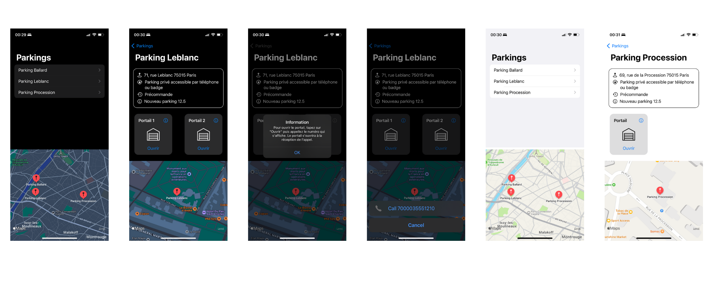

# DouzePointCinq - Test app
Simple iOS app to open parking lot gates by phone calls.

## Screenshots (dark & light modes)


## How to use

### Clone the project
```
$ git clone git@github.com:AnthYou/DouzePointCinqTest.git
$ cd DouzePointCinqTest
```

### Open with Xcode
Be sure to have Xcode installed on your Mac (you can download it on the App Store).

```
$ cd DouzePointCinqTest
$ open DouzePointCinqTest.xcodeproj -a Xcode
```

### Connect your iPhone to your Mac
As the simulator is not able to make phone calls, you will need a physical iPhone to open the gates.
First, connect your iPhone to your mac and choose the device in the run destination menu.
If you choose a real device, add your Apple ID in Accounts preferences and assign the project to a team on the Signing & Capabilities pane of the project editor.
A single individual constitutes a one-person team.
For macOS apps, you need to code sign the app if you enable certain capabilities.
If you belong to the Apple Developer Program, you need to register the device before you can run the app.

### Enjoy!
**IMPORTANT: you will only be able to open the gates if your phone number is registered in the 12p5 Intratone database.**
This app supports both light mode and dark mode.
